# Results

All three architectures are implemented from scratch in PyTorch, following the original papers.

---

## 1. Pix2Pix

**Paper:** Isola et al., *Image-to-Image Translation with Conditional Adversarial Networks*, 2017
[[arXiv:1611.07004]](https://arxiv.org/abs/1611.07004)

Trained on the maps dataset (map → satellite), 100 epochs, 568 training pairs.

**Training progression (row order: input map → generated satellite → real satellite):**

| Epoch 25 | Epoch 50 | Epoch 75 | Epoch 100 |
|----------|----------|----------|-----------|
| 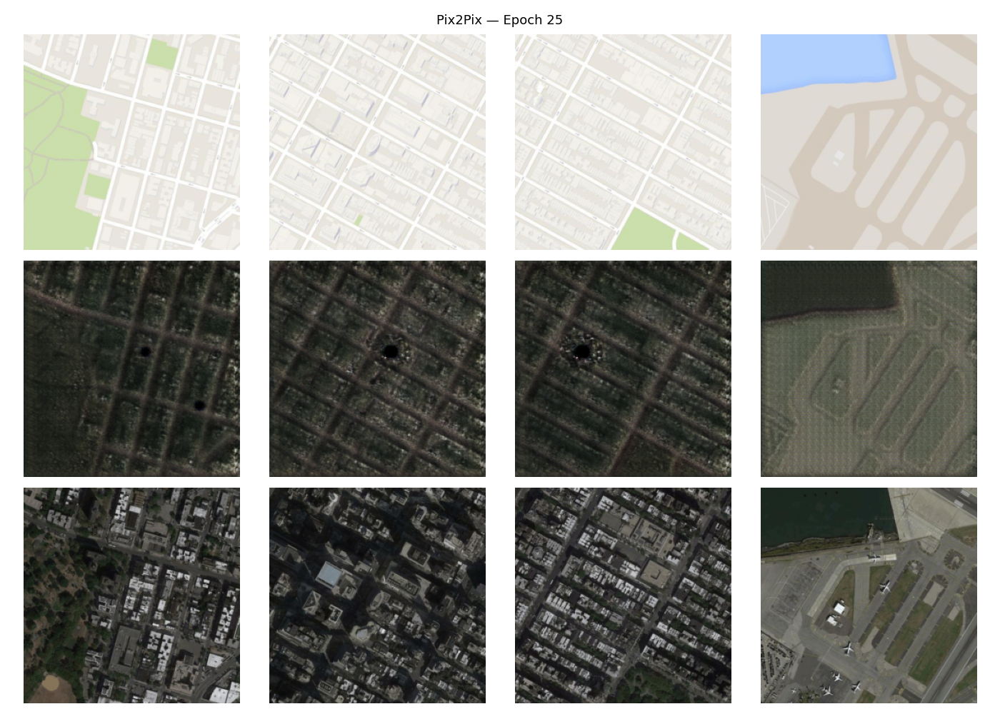 | 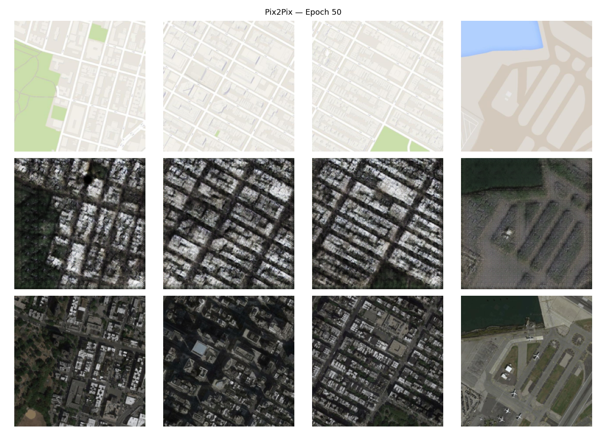 | 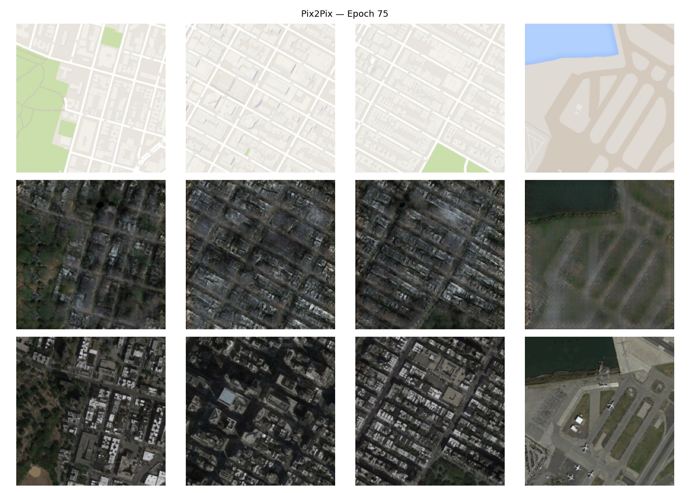 | 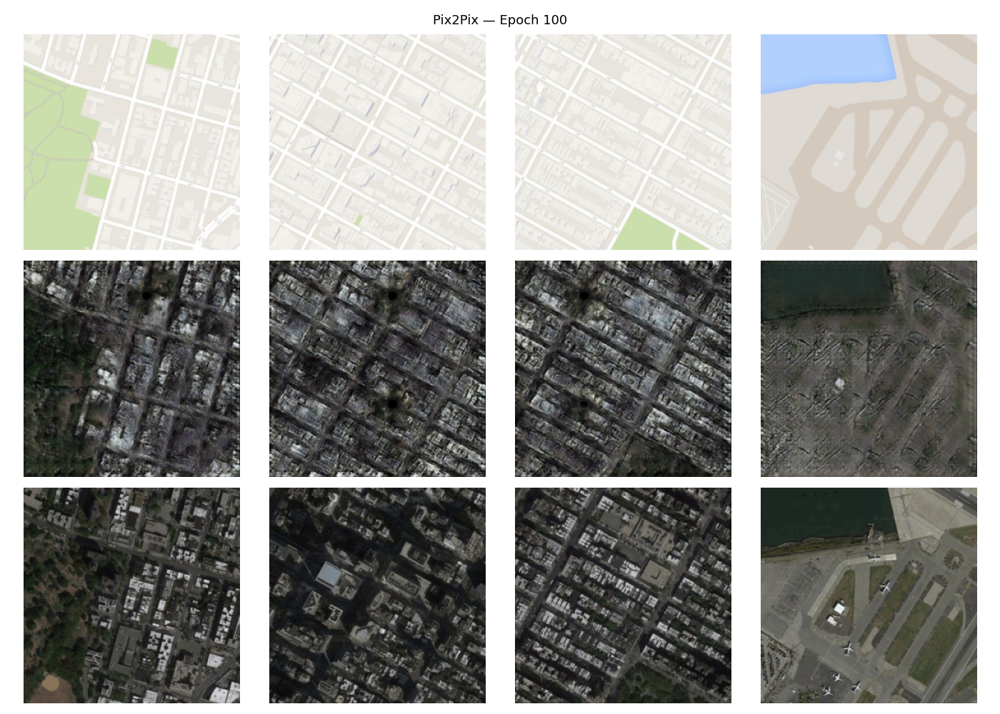 |

By epoch 50 the model learns coarse structure (road grids, water bodies); by epoch 100 it recovers fine texture details. The L1 loss term (λ=100) keeps outputs pixel-aligned but can produce slightly blurred results, a known Pix2Pix trade-off.

---

## 2. CycleGAN

**Paper:** Zhu et al., *Unpaired Image-to-Image Translation using Cycle-Consistent Adversarial Networks*, 2017
[[arXiv:1703.10593]](https://arxiv.org/abs/1703.10593)

Trained on the same maps dataset treated as **unpaired** (domains shuffled independently), 50 epochs.

**Training progression (row order: Domain A → G_AB(A) | Domain B → G_BA(B)):**

| Epoch 10 | Epoch 30 | Epoch 50 |
|----------|----------|----------|
| 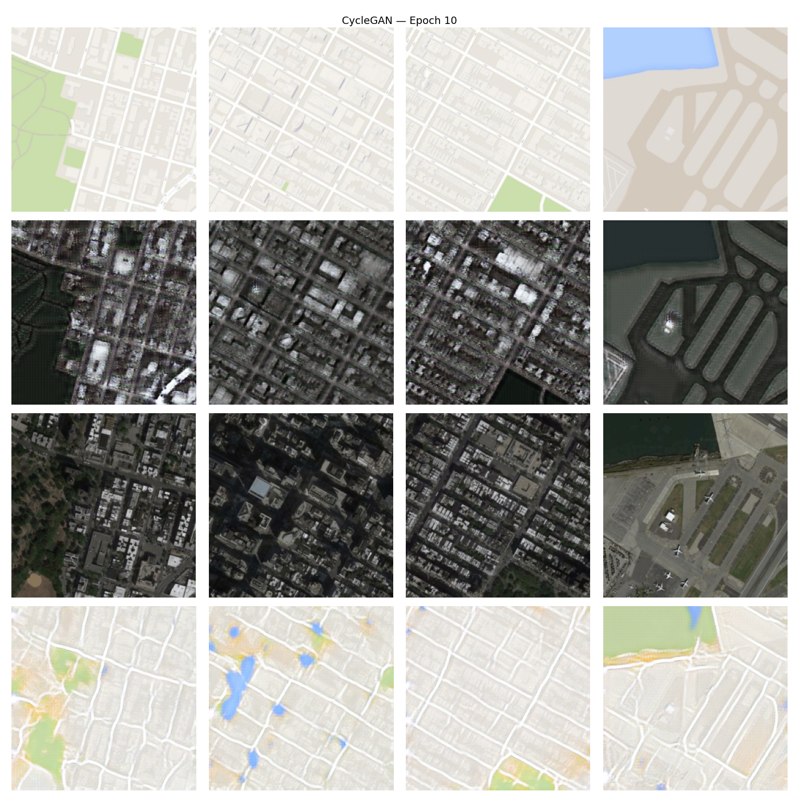 | 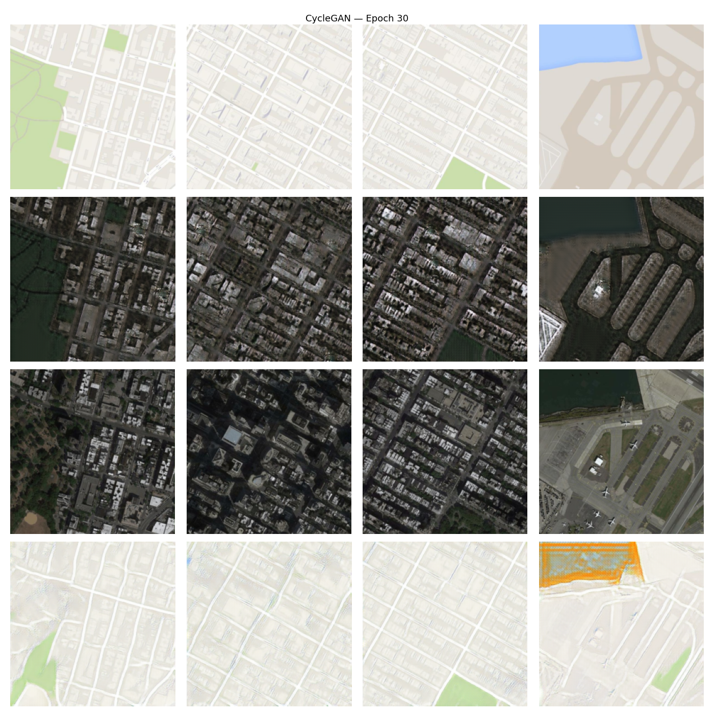 | 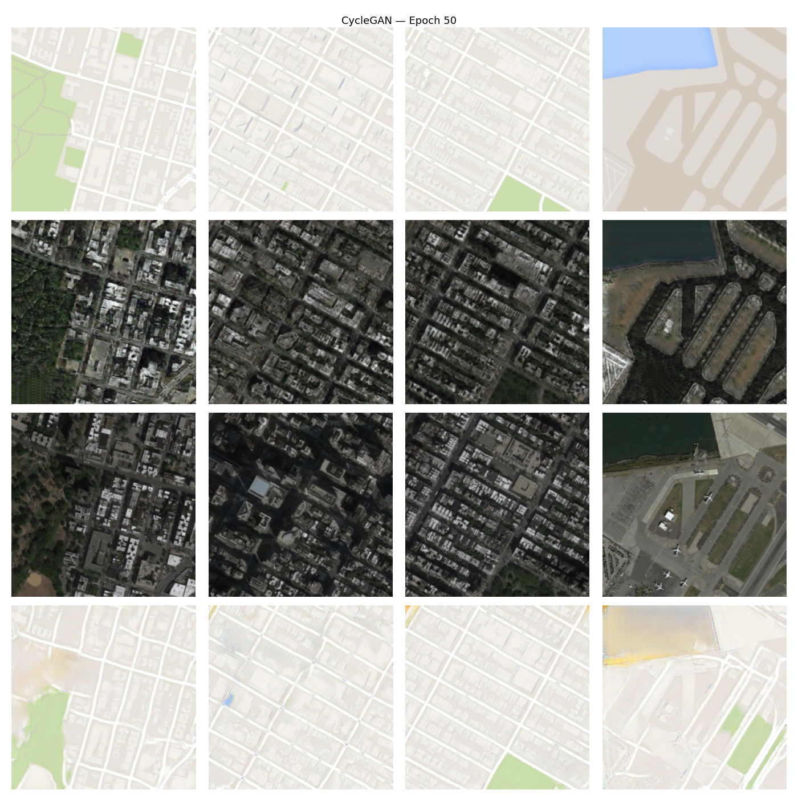 |

**Loss curves:**

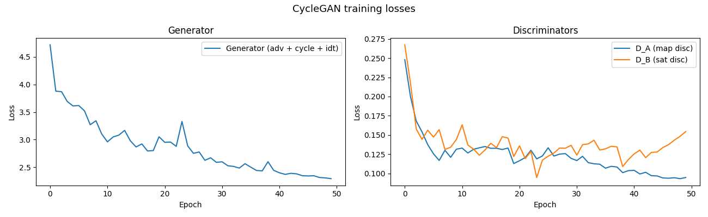

Cycle consistency (λ=10) forces G_BA(G_AB(A)) ≈ A, preventing mode collapse without paired supervision. Generator loss converges slowly because of the three competing objectives (adversarial + cycle + identity). Discriminator losses stabilise around 0.3–0.5, which is the expected LSGAN equilibrium.

---

## 3. Pix2Pix vs CycleGAN: Quantitative Comparison

Evaluated on 100 held-out validation pairs (maps dataset).

| Metric | Pix2Pix | CycleGAN |
|--------|---------|----------|
| **SSIM** ↑ | 0.2724 | **0.2972** |
| **PSNR (dB)** ↑ | **16.69** | 16.44 |
| **FID** ↓ | 300.77 | **162.76** |
| Training time | 35 min | 284 min |
| Parameters | 57.2 M | 28.3 M |
| Supervision | paired | unpaired |

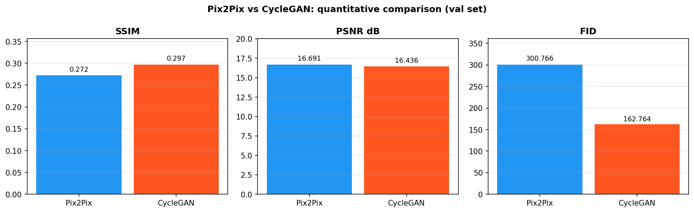

**SSIM** (Structural Similarity Index) — measures perceived structural similarity (luminance, contrast, structure). Range [−1, 1], higher is better.

**PSNR** (Peak Signal-to-Noise Ratio) — pixel-level fidelity in dB, derived from MSE against ground truth. Higher is better; 16–20 dB is typical for GAN-based translation at 256×256.

**FID** (Fréchet Inception Distance) — compares the distribution of generated images to real ones in InceptionV3 feature space. Captures both quality and diversity. Lower is better. Ref: Heusel et al., 2017.

Pix2Pix edges CycleGAN on PSNR because direct L1 supervision minimises per-pixel error. CycleGAN wins on SSIM and decisively on FID — without being forced to match individual pixels, it generates more perceptually realistic and diverse textures. The trade-off is 8× longer training time.

**Visual comparison (Input map → Real satellite → Pix2Pix → CycleGAN):**

---

## 4. Conditional GAN (cGAN)

**Paper:** Mirza & Osindero, *Conditional Generative Adversarial Nets*, 2014
[[arXiv:1411.1784]](https://arxiv.org/abs/1411.1784)

Trained on CIFAR-10 (bird, cat, dog — indices 2, 3, 5), 50 epochs at 32×32.

**Generated samples at epoch 50 (rows: bird · cat · dog):**

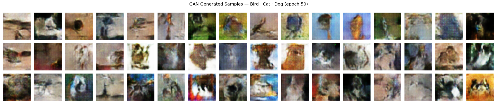

**Training progression:**

| Epoch 1 | Epoch 20 | Epoch 50 |
|---------|---------|---------|
| 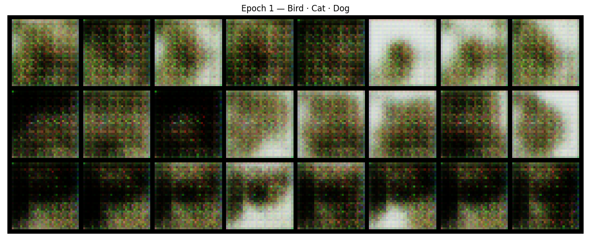 | 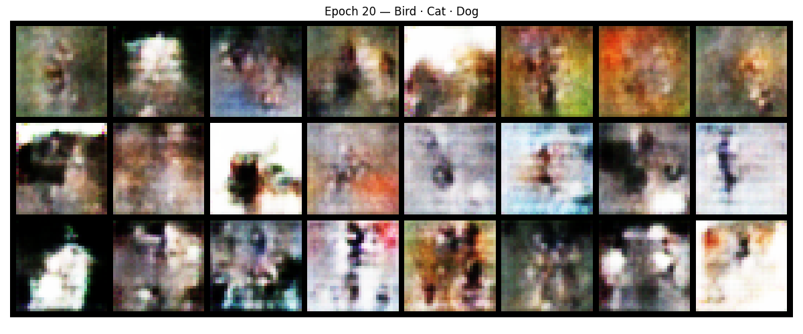 | 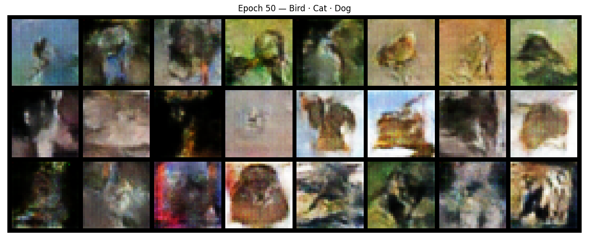 |

**FID scores per class (lower = better):**

| Class | FID |
|-------|-----|
| Bird | 133.64 |
| Cat | 144.18 |
| Dog | 152.88 |
| **Overall** | **104.32** |

FID above 100 is expected for 32×32 CIFAR images at 50 epochs — the low resolution limits both training stability and metric quality. The model correctly conditions on class labels (distinct colour/shape per row from epoch ~20 onward), confirming that the label embedding is working. Higher FID for cat/dog reflects their greater intra-class visual variance compared to bird.
